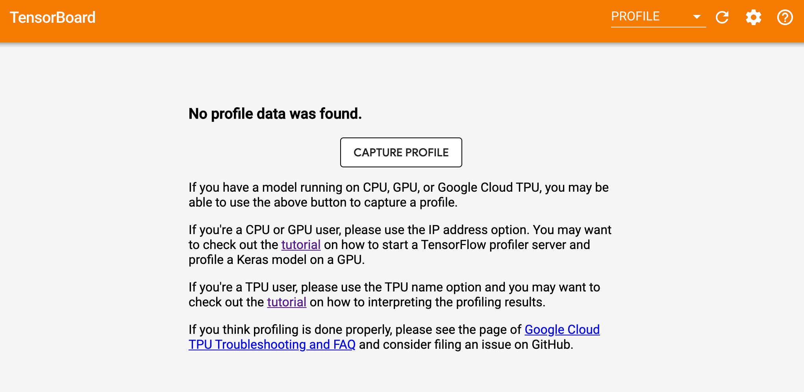

# TensorFlow Profiler
The TensorFlow Profiler includes a suite of tools. These tools help you understand, debug and optimize TensorFlow programs to run on CPUs, GPUs and TPUs.

## Prerequisites
* TensorFlow >= 2.2.0 
* TensorBoard >= 2.2.0 
* tensorboard-plugin-profile >= 2.2.0rc0

To profile on the GPU, on machine with the GPU installed, you must: 
1. Install CUDA 10.2 or newer
2. Install CUPTI and ensure that it exists on the path.

    *   Run `ldconfig -p | grep libcupti`
    *   If you don't have CUPTI on the path, run:

        ```shell
        export LD_LIBRARY_PATH=/usr/local/cuda/extras/CUPTI/lib64:$LD_LIBRARY_PATH
        ```

    *   Run the `ldconfig` command above again to verify that the CUPTI library
        is found

To profile multi-worker GPU configurations, profile individual workers
independently.

To profile cloud TPUs, you must have access to Google Cloud TPUs.

## Quick Start
Install the profiler by downloading and running the `install_and_run.py` script from this directory.
```
$ git clone https://github.com/tensorflow/profiler.git profiler
$ mkdir profile_env
$ mkdir profile_data
$ python3 profiler/install_and_run.py --envdir=profile_env --logdir=profile_data
```
Go to `localhost:6006/#profile` of your browser, you should now see TensorBoard profile dashboard show up.

Congratulations! You're now ready to capture a profile.

## Next Steps
* Colab Tutorial: https://www.tensorflow.org/tensorboard/tensorboard_profiling_keras
* Guide:  https://tensorflow.org/guide/profiler
* Cloud TPU Profiling Tutorial: https://cloud.google.com/tpu/docs/cloud-tpu-tools
