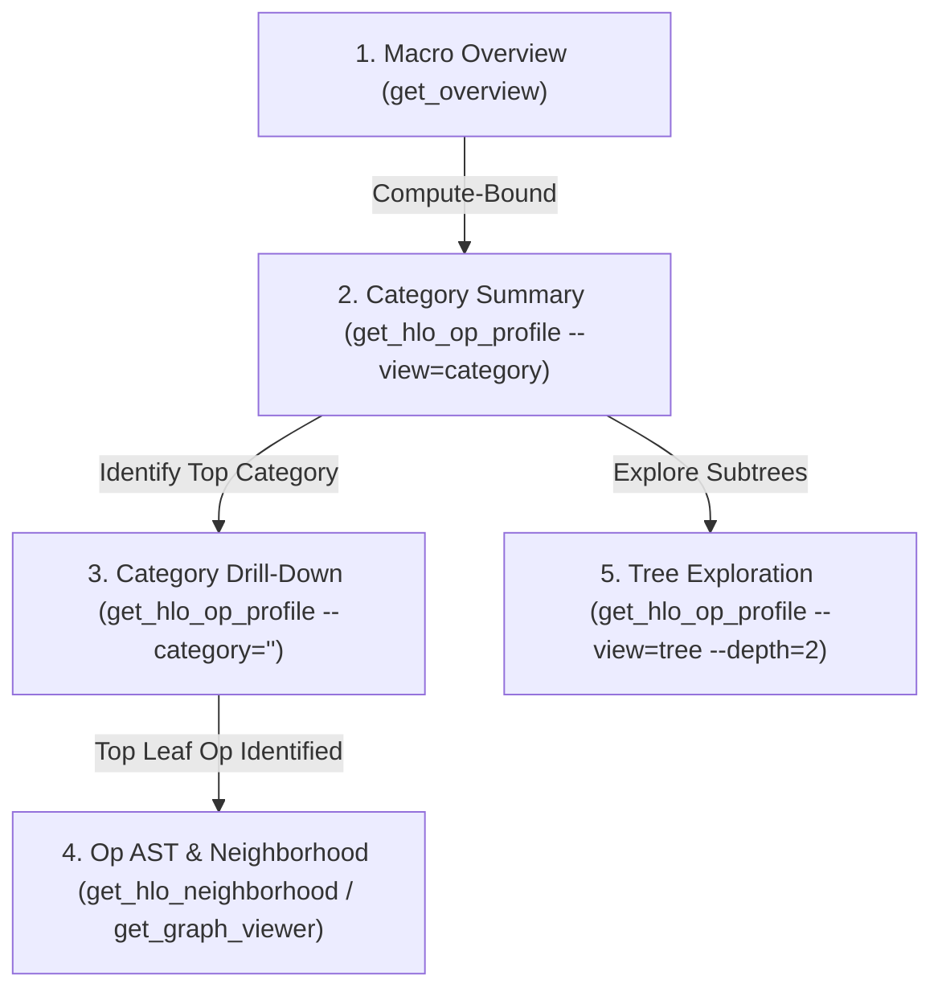

# `xprof-get-hlo-op-profile` Reference

This reference explains how to use `get_hlo_op_profile` to inspect HLO
operations with progressive macro-to-micro category breakdown, category
filtering, and hierarchical parent-child AST tree traversal.

> [!NOTE] `get_hlo_op_profile` is the canonical progressive disclosure tool for
> op-level profiling. Always start with the high-level category breakdown before
> drilling into specific individual operations.

--------------------------------------------------------------------------------

## Prerequisites

-   You must have the `<logdir_or_session_id>` for the specific XProf run.

--------------------------------------------------------------------------------

## Progressive Disclosure Workflow



--------------------------------------------------------------------------------

## View Modes & Commands

### 1. Default Progressive View (`view="grouped"`)

Returns a top-level `category_summary`, top leaf operations grouped by category
with their `category_fraction`, and `navigation_hints`.

```bash
xprof get_hlo_op_profile <trace_path> --top_n=3
```

### 2. Macro Category Summary Only (`view="category"` or `view="summary"`)

Returns only the high-level category breakdown of execution time without leaf
operations.

```bash
xprof get_hlo_op_profile <trace_path> --view=category
```

### 3. Category-Filtered Drill-Down (`--category="<name>"`)

Filters directly into a specific category (case-insensitive substring match) to
inspect only its top operations, source code provenance (file and line numbers),
and drill-down navigation hints.

```bash
xprof get_hlo_op_profile <trace_path> --category="custom-call" --top_n=5
```

### 4. Hierarchical Parent-Child Tree Traversal (`view="tree"`)

Explores the parent-child operation tree starting at `--path` (e.g.
`by_category` or `by_program`) up to a specified `--depth`.

```bash
xprof get_hlo_op_profile <trace_path> --view=tree --path="by_category/convolution fusion" --depth=2
```

### 5. Legacy Flat Leaf List (`view="flat"`)

Returns a raw list of leaf operations sorted by time for backward compatibility.

```bash
xprof get_hlo_op_profile <trace_path> --view=flat --top_n=15
```

--------------------------------------------------------------------------------

## Standard Navigation Hints

All structured responses contain a `navigation_hints` dictionary with
copy-pasteable command templates and discovery lists:

```json
"navigation_hints": {
  "drill_down_category": "xprof get_hlo_op_profile <trace> --category='<category_name>'",
  "inspect_op_neighborhood": "xprof get_hlo_neighborhood <trace> --instruction_name='<op_name>'",
  "inspect_graph": "xprof get_graph_viewer <trace> --node_name='<op_name>'",
  "inspect_roofline": "xprof get_roofline_model <trace>",
  "explore_tree": "xprof get_hlo_op_profile <trace> --view=tree --path='<path>' --depth=2",
  "available_categories": [
    "convolution fusion",
    "loop fusion",
    "collective-permute-done",
    "custom-call",
    "all-gather"
  ]
}
```
